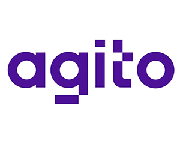

# 🖋️ Hey! I'm FurkancanYılmaz.
- 👑 I’m currently working with **C# .NET and anything related with JavaScript**.
- 📬 How to reach me: [furkancaanyilmaz@gmail.com](mailto:furkancaanyilmaz@gmail.com)
- 📡 Connect with me:

 - 💼 Experience:
 -  Software development (intern)
 -  Business Analyst, Software development (intern)
 - 
- 🚀 Technologies:

- 🛠 Tools:

  

  

